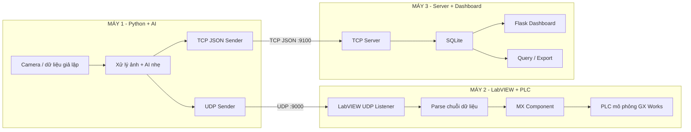
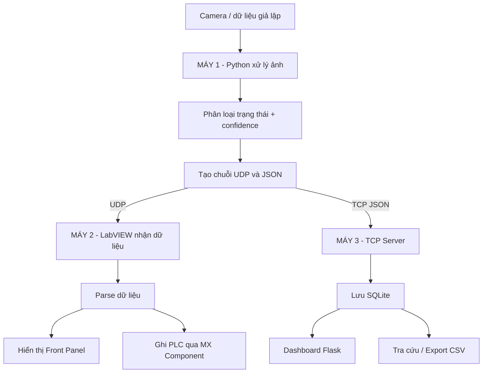

# Hệ thống 3 máy: Python AI - LabVIEW/PLC - Flask Dashboard

Mô hình hệ thống 3 máy phục vụ bài toán thu thập dữ liệu, phân loại trạng thái, truyền thông công nghiệp và giám sát thời gian thực.

- **MÁY 1**: Python + camera + AI nhẹ / computer vision
- **MÁY 2**: LabVIEW + PLC Mitsubishi (GX Works + MX Component)
- **MÁY 3**: Python TCP Server + SQLite + Flask Dashboard

---

## 1. Mục tiêu hệ thống

Hệ thống được xây dựng theo kiến trúc phân tán gồm 3 máy tính có kết nối mạng nội bộ:

- MÁY 1 thu nhận dữ liệu từ camera hoặc dữ liệu giả lập.
- MÁY 1 xử lý ảnh, xác định trạng thái và tạo giá trị confidence.
- MÁY 1 gửi dữ liệu sang MÁY 2 bằng **UDP** để LabVIEW nhận và truyền xuống PLC mô phỏng.
- MÁY 1 đồng thời gửi dữ liệu sang MÁY 3 bằng **TCP JSON** để lưu trữ và hiển thị lên Dashboard.
- MÁY 3 lưu dữ liệu vào SQLite, hỗ trợ theo dõi trạng thái và truy vấn lịch sử.

Hệ thống phù hợp cho mục đích học tập, demo đồ án, mô phỏng truyền thông giữa Python - LabVIEW - PLC - Web.

---

## 2. Kiến trúc tổng thể

### 2.1. Sơ đồ mạng hệ thống



### 2.2. Sơ đồ luồng dữ liệu



---

## 3. Công nghệ sử dụng

### MÁY 1
- Python 3.10
- OpenCV
- NumPy
- Pillow
- Tkinter

### MÁY 2
- LabVIEW
- GX Works / GX Works2 / GX Works3
- MX Component
- PLC Simulator hoặc PLC Mitsubishi

### MÁY 3
- Python 3.10
- Flask
- SQLite
- HTML / CSS / JavaScript

---

## 4. Cấu trúc dự án

```text
.
├── camera.py
├── SQlite-listen.py
├── app.py
├── index.html
├── query.html
├── requirements.txt
├── README_MAY_1.md
├── README_MAY_2.md
├── README_MAY_3.md
└── robot_sorting.db   (tự tạo khi chạy MÁY 3)
```

---

## 5. Chức năng từng máy

## 5.1. MÁY 1 - Python + Camera + AI nhẹ

**Nhiệm vụ chính**
- Thu nhận hình ảnh từ camera.
- Xử lý ảnh và xác định trạng thái hoạt động.
- Tính toán confidence.
- Gửi chuỗi dữ liệu sang MÁY 2 bằng UDP.
- Gửi JSON sang MÁY 3 bằng TCP để lưu cơ sở dữ liệu.

**File sử dụng**
- `camera.py`
- `requirements.txt`

**Dữ liệu gửi sang LabVIEW**
```text
R01 2026-03-07_21:15:12 SORTING red red_bin success 0.94
```

**JSON gửi sang MÁY 3**
```json
{
  "robot_id": "R01",
  "timestamp": "2026-03-07_21:15:12",
  "status": "SORTING",
  "object_color_detected": "red",
  "target_bin": "red_bin",
  "action_result": "success",
  "confidence": 0.94
}
```

---

## 5.2. MÁY 2 - LabVIEW + PLC

**Nhiệm vụ chính**
- Nhận dữ liệu UDP từ MÁY 1.
- Parse chuỗi dữ liệu trong LabVIEW.
- Hiển thị trạng thái trên Front Panel.
- Gửi dữ liệu xuống PLC mô phỏng qua MX Component.

**File / project sử dụng**
- File LabVIEW `.vi`
- Project GX Works
- Cấu hình MX Component

**Format parse LabVIEW**
```text
%s %<%Y-%m-%d_%H:%M:%S>T %s %s %s %s %f
```

**Biến PLC gợi ý**
- `STATUS`
- `ERROR_CODE`
- `OPERATE`
- `DECISION`
- `FIX_DONE`
- `ALARM`

---

## 5.3. MÁY 3 - Python Server + SQLite + Dashboard

**Nhiệm vụ chính**
- Nhận dữ liệu JSON từ MÁY 1 qua TCP.
- Lưu dữ liệu vào SQLite.
- Hiển thị Dashboard web.
- Hỗ trợ truy vấn và xuất dữ liệu.

**File sử dụng**
- `SQlite-listen.py`
- `app.py`
- `index.html`
- `query.html`
- `robot_sorting.db`

---

## 6. Yêu cầu cài đặt

## 6.1. Phần mềm cần có

### Chung
- Windows 10/11
- Mạng LAN hoặc cùng máy để demo cục bộ

### MÁY 1 và MÁY 3
- Python 3.10.x

### MÁY 2
- LabVIEW
- GX Works / GX Works2 / GX Works3
- MX Component
- PLC Simulator hoặc PLC thật

---

## 7. Cài đặt nhanh Python

Dùng chung cho MÁY 1 và MÁY 3:

```bash
python -m venv venv
venv\Scripts\activate
pip install --upgrade pip
pip install -r requirements.txt
```

**requirements.txt**
```txt
flask
opencv-python
numpy
pillow
```

---

## 8. Cấu hình mạng

| Thành phần | Giao thức | Port mặc định | Ghi chú |
|---|---|---:|---|
| MÁY 1 -> MÁY 2 | UDP | 9000 | LabVIEW lắng nghe |
| MÁY 1 -> MÁY 3 | TCP JSON | 9100 | TCP server ghi SQLite |
| Dashboard MÁY 3 | HTTP | 9123 | Truy cập bằng trình duyệt |

### Ví dụ IP trong mạng LAN
- MÁY 1: `192.168.1.10`
- MÁY 2: `192.168.1.20`
- MÁY 3: `192.168.1.30`

### Cấu hình cần chỉnh
- Trong `camera.py`:
  - IP MÁY 2: `192.168.1.20`
  - UDP Port: `9000`
  - IP MÁY 3: `192.168.1.30`
  - TCP Port: `9100`
- Trong `SQlite-listen.py`:
  - Nếu chạy khác máy trong LAN, nên dùng:
  ```python
  HOST = "0.0.0.0"
  PORT = 9100
  ```

---

## 9. Hướng dẫn chạy hệ thống

## 9.1. Chạy MÁY 3 trước

### Bước 1 - Chạy TCP server ghi SQLite
```bash
python SQlite-listen.py
```

### Bước 2 - Chạy Flask Dashboard
Mở cửa sổ lệnh thứ hai:
```bash
python app.py
```

### Bước 3 - Mở trình duyệt
```text
http://127.0.0.1:9123
```
Hoặc từ máy khác trong LAN:
```text
http://IP_MAY_3:9123
```

---

## 9.2. Chạy MÁY 2

1. Mở project PLC trong GX Works.
2. Chạy PLC Simulator hoặc kết nối PLC thật.
3. Kiểm tra MX Component.
4. Mở file VI LabVIEW.
5. Kiểm tra cổng UDP lắng nghe là `9000`.
6. Nhấn **Run** để bắt đầu UDP Listener.

---

## 9.3. Chạy MÁY 1

```bash
python camera.py
```

**Các bước vận hành**
1. Mở camera trong giao diện.
2. Kiểm tra IP và port của MÁY 2, MÁY 3.
3. Đưa vật thể màu vào khung hình hoặc dùng dữ liệu giả lập.
4. Quan sát log gửi UDP và JSON.

---

## 10. Trình tự chạy đề xuất

1. Chạy `SQlite-listen.py` trên MÁY 3.
2. Chạy `app.py` trên MÁY 3.
3. Mở PLC Simulator / PLC thật trên MÁY 2.
4. Mở VI LabVIEW và chạy UDP Listener trên MÁY 2.
5. Chạy `camera.py` trên MÁY 1.
6. Kiểm tra Dashboard, LabVIEW và PLC cùng cập nhật dữ liệu.

---

## 11. Kiểm tra hoạt động

### Kiểm tra MÁY 1
- Camera hiển thị hình ảnh.
- Có log gửi dữ liệu.
- Không báo lỗi socket.

### Kiểm tra MÁY 2
- LabVIEW nhận được chuỗi dữ liệu.
- Parse đúng các trường.
- PLC nhận được dữ liệu ở vùng nhớ cấu hình.

### Kiểm tra MÁY 3
- TCP server hiển thị log kết nối.
- `robot_sorting.db` được tạo tự động.
- Dashboard hiển thị dữ liệu mới nhất.
- Trang query có thể lọc và export dữ liệu.

---

## 12. Xử lý lỗi thường gặp

### Không mở được camera
- Kiểm tra webcam có đang bị phần mềm khác sử dụng không.
- Thử đổi `CAMERA_INDEX` trong `camera.py`.

### MÁY 2 không nhận UDP
- Kiểm tra IP MÁY 2.
- Kiểm tra port `9000`.
- Kiểm tra firewall Windows.

### MÁY 3 không lưu được DB
- Kiểm tra `SQlite-listen.py` đã chạy chưa.
- Kiểm tra IP / port `9100`.
- Nếu chạy khác máy, đổi `HOST = "0.0.0.0"`.

### Dashboard không mở được
- Kiểm tra `app.py` đã chạy chưa.
- Kiểm tra port `9123`.
- Thử `http://127.0.0.1:9123`.

### Dashboard có dữ liệu cũ hoặc không cập nhật
- Kiểm tra `SQlite-listen.py` và `app.py` có đang dùng cùng file `robot_sorting.db` không.

---

## 13. Mức độ hoàn thiện hiện tại

### Đã thực hiện
- Xây dựng mô hình 3 máy có truyền thông dữ liệu.
- Kết hợp Python, LabVIEW, PLC và Dashboard web.
- Gửi dữ liệu thời gian thực sang LabVIEW và server lưu trữ.
- Hỗ trợ hiển thị và tra cứu dữ liệu.

### Giới hạn hiện tại
- Phù hợp cho học tập, demo, thử nghiệm nội bộ.
- Chưa tối ưu cho triển khai thực tế quy mô lớn.
- Bảo mật mới ở mức cơ bản.

---

## 14. Hướng phát triển

- Thay AI nhẹ bằng mô hình AI sâu hơn.
- Kết nối PLC thật thay cho mô phỏng.
- Nâng cấp truyền thông sang HTTP/HTTPS, MQTT hoặc OPC UA.
- Bổ sung xác thực, mã hóa và phân quyền truy cập.
- Thay SQLite bằng MySQL/PostgreSQL nếu cần lưu trữ lớn hơn.
- Mở rộng Dashboard với cảnh báo, biểu đồ và phân tích nâng cao.

---

## 15. Tài liệu tham khảo

- Python Documentation: https://docs.python.org/3.10/
- OpenCV Documentation: https://docs.opencv.org/master/index.html
- Flask Documentation: https://flask.palletsprojects.com/
- NI LabVIEW TCP/UDP: https://www.ni.com/docs/en-US/bundle/labview/page/using-labview-with-tcpip-and-udp.html
- NI LabVIEW UDP Reference: https://www.ni.com/docs/en-US/bundle/labview-api-ref/page/menus/categories/data-communication/protocols/udp-mnu.html
- Mitsubishi MX Component: https://www.mitsubishielectric.com/fa/products/cnt/plceng/smerit/mx_component/index.html
- GX Works3: https://www.mitsubishielectric.com/fa/products/cnt/plceng/smerit/gx_works3/index.html

---

## 16. Ghi chú

README này dùng để mô tả tổng thể hệ thống khi đăng GitHub. Hướng dẫn chi tiết cho từng máy có thể xem thêm tại:

- `README_MAY_1.md`
- `README_MAY_2.md`
- `README_MAY_3.md`

